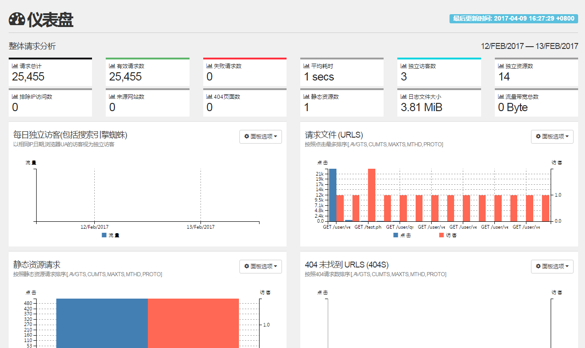

GoAccess 中文版，此中文版基于官方 goaccess 1.2 版本汉化，绝对原汁原味。
### GoAccess 中文界面



### GoAccess 安装方法

编译安装之前需要安装 geoip 开发包，下载地址 https://github.com/maxmind/geoip-api-c
`CentOS安装GeoIP`
```
yum install GeoIP
#安装依赖
yum install ncurses-devel

$ yum install -y git
$ git clone https://github.com/typefo/goaccess.git
$ cd goaccess
$ ./configure --enable-utf8 --enable-geoip=legacy
$ make
$ make install
```


